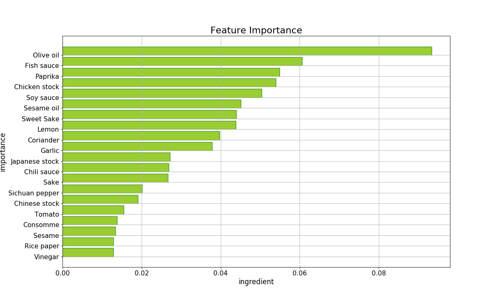

# Truth of Food Style

## Overview
Explore the determinant or essential ingredients of culture’s cuisine, for example, Japanese cuisine, Chinese cuisine, Spanish cuisine and so on.

## Aims
- Evaluate how various “country-style” cuisine arranged in each country is really close to that culture’s cuisine.
- Moreover, develop learning materials for working on machine learning programming for the first time.

## Method
Extract only list of ingredients from cuisine recipes, create BOW(Bag of Words), and create model using machine learning. Originally, it seems necessary to have various characteristics such as quantity of ingredients or instructions, but in this project, it is also aimed at beginner of AI to learn its programming, so we focused on making it as simple as possible.
<br>
To predict culture or country, we examine what kind of ingredients are more important features.
## Sample


```sh
[2019/04/07 17:25:46] ========== toi_tst.py start ==========
[2019/04/07 17:25:46] --model--
[2019/04/07 17:25:46] RandomForestClassifier(bootstrap=True, class_weight=None, criterion='gini',
            max_depth=None, max_features='auto', max_leaf_nodes=None,
            min_impurity_split=1e-07, min_samples_leaf=1,
            min_samples_split=2, min_weight_fraction_leaf=0.0,
            n_estimators=10, n_jobs=1, oob_score=False, random_state=0,
            verbose=0, warm_start=False)
[2019/04/07 17:25:46] --y_pred--
[2019/04/07 17:25:46] [0 0 0 0 0 0 0 0 0 0 1 0 1 1 1 1 1 1 1 0 2 2 2 2 2 2 2 2 2 2 3 3 3 3 3 3 1
 3 0 3]
[2019/04/07 17:25:46] accuracy: 90.00%
```

## Preparation

### Environment
- OS: MacOS (maybe every Linux system OK, but require graphical interfaces)
- Language: Python 3.6.1 (Anaconda 4.4.0)

### Using Python Libraries
##### Standard Library
- argparse: Parser for command-line options, arguments and sub-commands
- json: JSON encoder and decoder
- logging: Logging facility for Python
- os: Miscellaneous operating system interfaces
- pickle: Python object serialization
- re: Regular expression operations
- requests: HTTP Library
- shutil: High-level file operations
- subprocess: Subprocess management
- sys: System-specific parameters and functions
- time: Time access and conversions


##### Python Machine Learning
- Beautiful Soup: Python library designed for quick turnaround projects like screen-scraping
- gensim: Python library designed to automatically extract semantic topics from documents, as efficiently (computer-wise) and painlessly (human-wise) as possible
- pandas : Data analysis tools for the Python
- matplotlib: Python 2D plotting library
- numpy: Scientific computing with Python
- scikit-learn :  Machine learning library for the Python


### Installation
My favorite settings are as follows. (for MacOS)

#### ~/.bashrc

```sh
# set alias
alias ls='ls -FG'
alias ll='ls -lFG'
alias la='ls -aFG'
alias cp='cp -i'
alias rm='rm -i'
alias mv='mv -i'

# history grep
alias hg='history |grep'

# set prompt
PS1='\[\e[34m\]\w \[\e[37m\]\$\[\e[0m\] '

# edit history using vi
# press [Esc] quits from insert mode : press [k]:lines upward [j]:lines downward
set -o vi
```

#### ~/.vimrc

```sh
"--- for color ---
syntax on
colorscheme blackboard
set t_Co=256

"--- for line number ---
set number

"--- for Tab character ---
set tabstop=4
set expandtab
set shiftwidth=4
set softtabstop=4

"--- for visible ---
set list
set listchars=tab:»-,trail:-,nbsp:%
```

#### ~/.vim/colors/blackboard.vim
Copy the following files to the directory "~/.vim/colors".


[blackboard.vim](https://github.com/lisposter/vim-blackboard/blob/master/colors/blackboard.vim) - a colorscheme which ported from sublime text


## Tutorial
[00.Configuration](doc/step00.md) - configuring logger, serveral dictionaries and url pages

[01.Preparation 1 ](doc/step01.md) - collecting and cleansing data (both training and testing data)

[02.Preparation 2 ](doc/step02.md) - building a corpus

[03.Vectorize](doc/step03.md) - vectorize training data and testing data

[04.Training](doc/step04.md) - training and view importance features

[05.Testing](doc/step05.md) - testing and calculating accuracy

[06.Predicting](doc/step06.md) - predicting country style


## Demo

#### Trial 1

```sh
$ ./toi_demo.sh r1
-- cp ./toi_en_r1.py ./toi_en.py --
-- mv ./data/test* ./data/toi* ./data/train* ./data/previous/ --
-- cp -p ./def/toi_work1_r1.csv ./data/toi_work1.csv --
-- cp -p ./def/toi_target.csv ./data/ --
======= ToFS Pipeline =======
== Data Collecting and Cleansing ==

...

[2019/04/07 18:07:50] ========== toi_tst.py start ==========
[2019/04/07 18:07:50] --model--
[2019/04/07 18:07:50] RandomForestClassifier(bootstrap=True, class_weight=None, criterion='gini',
            max_depth=None, max_features='auto', max_leaf_nodes=None,
            min_impurity_split=1e-07, min_samples_leaf=1,
            min_samples_split=2, min_weight_fraction_leaf=0.0,
            n_estimators=10, n_jobs=1, oob_score=False, random_state=0,
            verbose=0, warm_start=False)
[2019/04/07 18:07:50] --y_pred--
[2019/04/07 18:07:50] [2 2 0 0 1 0 2 0 0 0 1 0 1 1 1 1 1 1 1 1 2 2 2 2 2 2 2 2 2 2 3 3 3 3 3 3 1
 3 3 3]
[2019/04/07 18:07:50] accuracy: 85.00%
$
```

#### Trial 2

```sh
$ ./toi_demo.sh r2
-- cp ./toi_en_r2.py ./toi_en.py --
-- mv ./data/test* ./data/toi* ./data/train* ./data/previous/ --
-- cp -p ./def/toi_work1_r2.csv ./data/toi_work1.csv --
-- cp -p ./def/toi_target.csv ./data/ --
======= ToFS Pipeline =======
== Data Collecting and Cleansing ==

...

[2019/04/07 18:18:13] ========== toi_tst.py start ==========
[2019/04/07 18:18:13] --model--
[2019/04/07 18:18:13] RandomForestClassifier(bootstrap=True, class_weight=None, criterion='gini',
            max_depth=None, max_features='auto', max_leaf_nodes=None,
            min_impurity_split=1e-07, min_samples_leaf=1,
            min_samples_split=2, min_weight_fraction_leaf=0.0,
            n_estimators=10, n_jobs=1, oob_score=False, random_state=0,
            verbose=0, warm_start=False)
[2019/04/07 18:18:13] --y_pred--
[2019/04/07 18:18:13] [0 0 0 0 0 0 0 0 0 0 1 0 1 1 1 1 1 1 1 0 2 2 2 2 2 2 2 2 2 2 3 3 3 3 3 3 1
 3 0 3]
[2019/04/07 18:18:13] accuracy: 90.00%
$
```


## See Also
- [vim](https://vim-jp.org/vimdoc-en/)  - Vim Documentation
- [blackboard.vim](https://github.com/lisposter/vim-blackboard) - a colorscheme which ported from sublime text
- [logging HowTo](https://docs.python.org/3/howto/logging.html) - Logging Tutorial

## License
MIT
